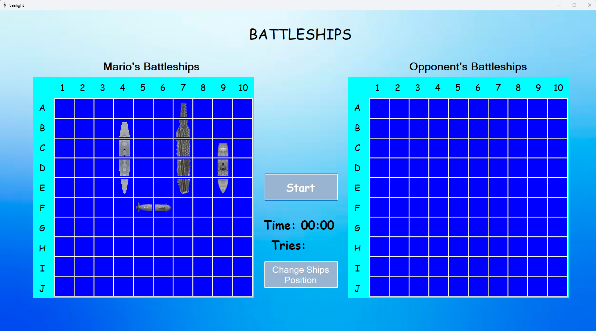
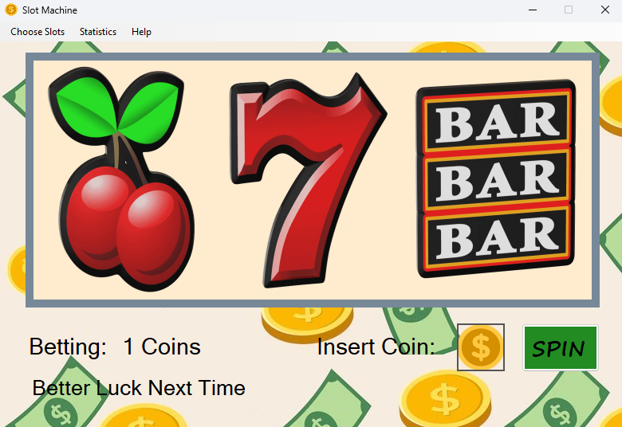
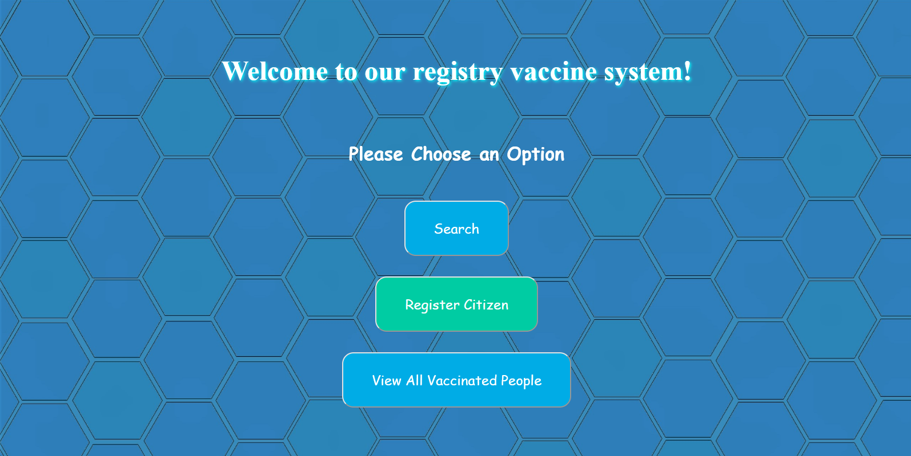

# Object-Oriented Application Development (2021) - Multiple Applications

## Project Overview

This project is a team assignment for the "Object-Oriented Application Development" course, offered in the 3rd semester of the 2021 academic year at the University of Piraeus, Department of Informatics. The goal is to develop three distinct applications in C#. The applications include:

- **Thema 1:** Battleship Game
- **Thema 2:** Slot Machine Simulation
- **Thema 3:** COVID-19 Vaccination Web Application

## Course Information

- **Institution:** University of Piraeus
- **Department:** Department of Informatics
- **Course:** Object-Oriented Application Development (2021)
- **Semester:** 3rd

## Technologies Used

- Javascript
- C#
- ASP.NET
- CSS

## Applications Details

### Thema 1: Battleship Game

#### Description:

Implement the classic game "Battleship" where players take turns guessing the locations of ships on a 10x10 grid. The game includes two grids:

- **Player Grid:** Displays the player's ships and shows hits or misses.
- **Opponent Grid:** Displays hits or misses for the player's guesses.

#### Features:

- **Ships:** Aircraft Carrier (5 cells), Destroyer (4 cells), Battleship (3 cells), Submarine (2 cells)
- **Game Mechanics:** Player guesses locations; computer randomly places ships and guesses.
- **Endgame:** Displays who won and how long it took.

#### Advanced Features:

- Database for recording game statistics (who won, game duration, etc.)

### Thema 2: Slot Machine Simulation

#### Description

Create a graphical slot machine game with 3 columns and 4 different fruit symbols. Players can place bets and see results after a delay.

#### Features:

- 3 Columns with 4 Symbols each
- Betting System: Players can win or lose coins based on the symbols.
- Display results after a simulated spinning delay.

#### Advanced Features:

- Configurable settings for columns and symbols
- Database to record coin usage and winnings

### Thema 3: COVID-19 Vaccination Web Application 

#### Description 

Develop a web application for recording COVID-19 vaccinations at a vaccination center.

#### Features

- Data Recorded: Full name, Email, Phone, Gender, Age, Underlying Conditions, Address, Date/Time of Vaccination
- Basic Operations: Add, View, Delete, Modify Records

#### Advanced Features

- Search functionality with customizable criteria

## Usage Examples

### Battleship Game
- **Player Turn:** Select a coordinate to attack, e.g., B-4.
- **Computer Turn:** The computer makes a random guess.

### Slot Machine Simulation
- **Place Bet:** Enter the amount of coins to bet.
- **Spin:** Click the button to spin the reels and view results.

### COVID-19 Vaccination Web Application
- **Add Record:** Fill out the form with vaccination details.
- **View Records:** Access the list of all vaccination records.
- **Search:** Use search functionality to find specific records.

## Setup Instructions

1. Battleship Game & Slot Machine Simulation:
- Clone the project repository from GitHub.
- Load the project in Visual Studio.
- Compile and execute the application.

2. COVID-19 Vaccination Web Application:
- Ensure you have a web server set up (e.g., IIS, Apache).
- Update database connection settings in the ServerConnection class
- Deploy the application and test functionalities.

## Contributors

<table>
  <tr>
    <td align="center"><a href="https://github.com/thkox"> <b>Theodoros Koxanoglou</b></a> </td>
    <td align="center"><a href="https://github.com/ApostolisSiampanis"> <b>Apostolis Siampanis</b></a> </td>
    <td align="center"><a href="https://github.com/AimiliosKourpas"> <b>Aimilianos Kourpas</b></a> </td>
  </tr>
</table>

## License

This project is licensed under the MIT License - see the [LICENSE](./LICENSE) file for details.
